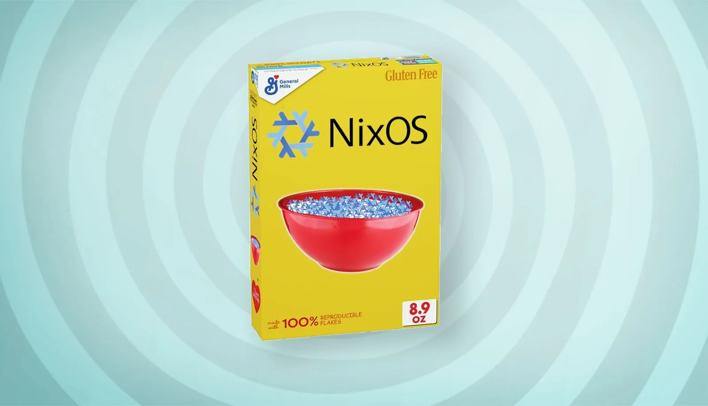
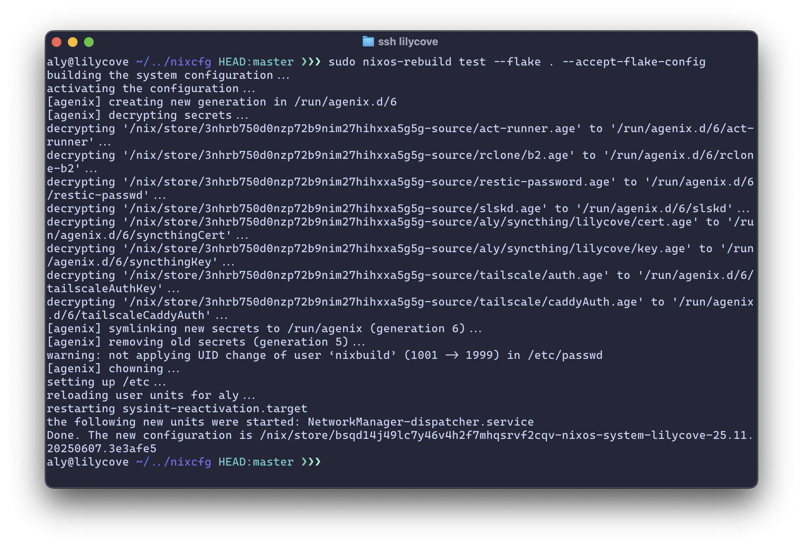
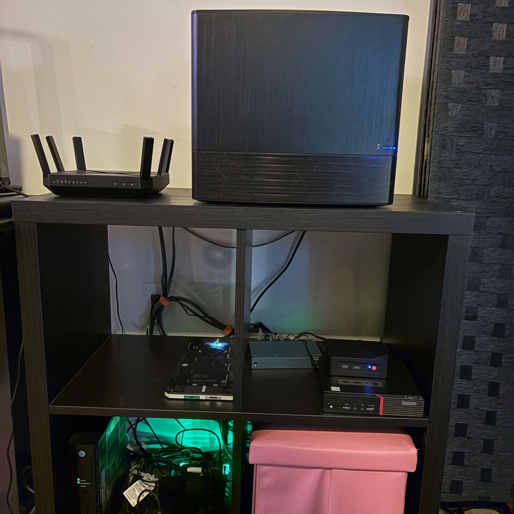
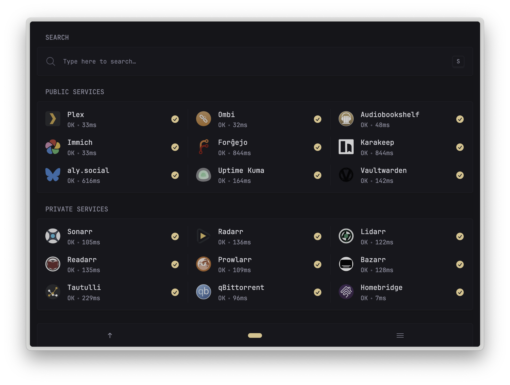
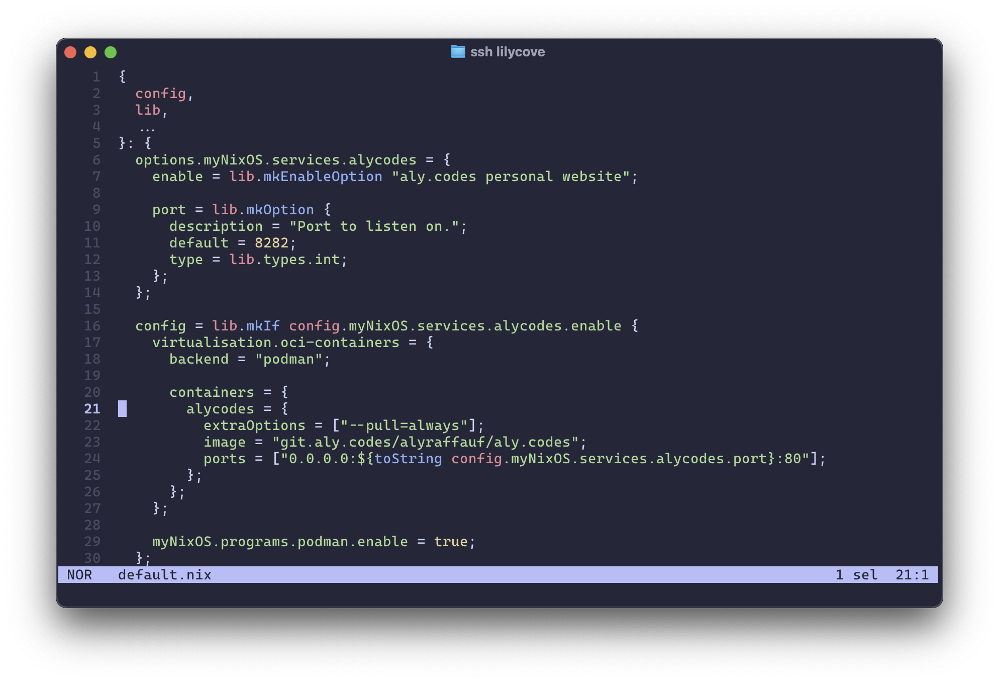
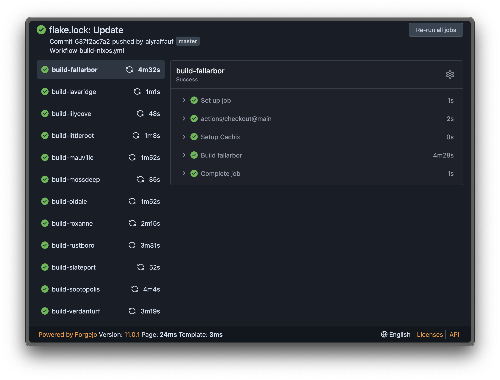
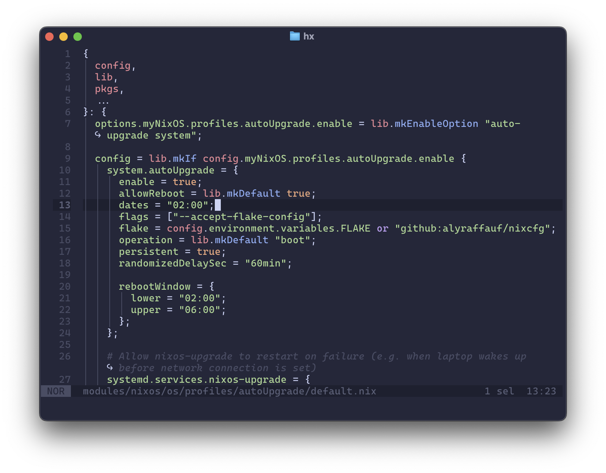

# Stop Breaking Things:

## A Gentle Introduction to NixOS in the Homelab

### Aly Raffauf

[self2025.aly.codes](https://self2025.aly.codes)


---

## About Me

- Using Linux since 2007.
- Self hosting since 2008.
- Building my own distros since 2009.
- Writing package managers since 2010.
- Occasional contributor to NixOS/nixpkgs and related projects.

<!--
And, if you know anything about Nix, and by the end of this you certainly should, you'll see how we ended up here.
-->

---

## How Server Maintenance Feels


<!--
The other reason we ended up here is because maintaing a server--one, two, 30, 50, 300--feels a lot like this.
-->

---

## The Problem

- Stuff breaks.
- We forget how we fixed it last time.
- Sometimes we don’t even know it’s broken.
- Fixes take too long.
- Recovery is slow, manual, and painful.

Mean time to recovery? What's that?

<!--
Here's the problem. and if you're not already intimately familiar with the problem, oh my god you will be.
-->

---

## What We Need

- Deployments we can rebuild from scratch — confidently.
- Infrastructure that documents itself.
- Version control — for configs, packages, services, environments.
- Reproducible results — today, next month, on new hardware.
- Rollbacks that _just work_.
- Resilient tooling that catches mistakes before they happen.

---

## What We've Tried

- Bash
- Ansible
- Docker

<!--
There are many others, but let's focus on these three.
-->

---

## Bash

- Writing good Bash is hard — and debugging it is harder.
- Scripts mutate the system with **no memory or structure**.
- Works great until someone reruns it on a slightly different machine.
- No built-in rollback, no state tracking, no reproducibility.
- **You are the package manager**.


---

## Ansible

- Looks declarative — but it's not truly **deterministic**.
- Final system state depends on execution order and host state.
- Still no rollbacks, and testing can be painful.
- YAML sucks.


<!--
Brings the system from an unknown state to another unknown state.
-->

---

## Docker

- Great for shipping **applications**, not entire systems.
- Depends heavily on **mutable base images**.
- "FROM ubuntu:latest" = hope you cached it.
- Dockerfiles are **imperative scripts in disguise**.


---

## Nix

I use NixOS btw.


<!--
And, if you're like me, you use NixOS (by the way).
-->

---

## What is Nix?

- A collision-free package manager.
- A side effect free build system.
- A purely functional Turing-complete programming language.
- A script-and-text-file orchestration system.
- A large repository of packages.
- A composable linux distro.


<!--
Talking about Nix can get confusing, because we're often conflating several different, but related, things.

Nix - the package manager.
Nix - the build system.
NixOS - the linux distro.
nixpkgs - the package repository.
-->

---

## Understanding Nix

| Imperative Systems                        | Nix (Declarative)                                                              |
| ----------------------------------------- | ------------------------------------------------------------------------------ |
| “Do this, then that...”                   | “Here’s what the system should look like.”                                     |
| Hidden changes in `/usr`, `/etc`, `$HOME` | Everything in `/nix/store` (immutable, content-addressed), symlinked elsewhere |
| Dependent on machine state                | Same inputs = same results, every time                                         |
| Manual rollback (if you're lucky)         | Atomic generations and easy rollbacks                                          |
| Bash, Ansible, `apt`, `dnf`               | `nix`, `nixos-rebuild`, `home-manager`                                         |
| Scripts, Playbooks                        | \*.nix files, Flakes                                                           |

---

## Flakes

- A standardized way to define & share Nix projects.
- Inputs → configuration logic → reproducible outputs.
- All inputs are locked in`flake.lock` to exact hashes.
- Outputs are cached in the Nix store — locally or remotely
- Flakes make Nix builds **composable**, **shareable**, and **reproducible by default**.



<!--
Meme source: https://fedi.astrid.tech/notice/AS7z9qW0q6SYs9LEsC
-->

---

## Flake Inputs

- Other flakes (like `nixpkgs`)
- Remote Git repositories (`github:user/repo`, `git+https://…`)
- Tarballs and zip archives (e.g. plugin releases, configs).
- Local directories (relative or absolute paths)

---

## Flake Outputs

- `packages`: apps, containers, files, tools, scripts.
- `devShells`: reproducible development environments.
- `nixosConfigurations`: full NixOS systems.
- `homeConfigurations`: Home Manager setups.
- `modules`: reusable app, system, or service configurations.
- `apps`: things you can run with `nix run`.

---

```nix
aly@fortree ~/../nixcfg HEAD:master ❯❯❯ nix flake show --all-systems
├───devShells
│   └───x86_64-linux
│       └───default: development environment 'nix-shell'
├───nixosConfigurations
│   └───sootopolis: NixOS configuration
├───nixosModules
│   ├───nixos: NixOS module
│   ├───snippets: NixOS module
│   └───users: NixOS module
├───overlays
│   └───default: Nixpkgs overlay
└───packages
    └───x86_64-linux
        ├───deployer: package 'deployer'
        └───formatter: package 'formatter'
```

---

## Hello, world!

```nix
{
  description = "Hello, world! with nixpkgs";

  inputs = {
    nixpkgs.url = "github:nixos/nixpkgs?ref=nixos-unstable";
  };

  outputs = { self, nixpkgs }: {
    packages.x86_64-linux.hello = nixpkgs.legacyPackages.x86_64-linux.hello;
  };
}
```

---

## OCI Containers

```nix
{
  description = "Hello, world! with docker";

  inputs = {
    nixpkgs.url = "github:nixos/nixpkgs?ref=nixos-unstable";
  };

  outputs = { self, nixpkgs }: {
    packages.x86_64-linux.dockerHello = nixpkgs.legacyPackages.x86_64-linux.dockerTools.buildImage {
      name = "hello";
      tag = "latest";
      contents = [ nixpkgs.legacyPackages.x86_64-linux.hello ];
      config.Cmd = [ "/bin/hello" ];
    };
  };
}
```

---

## NixOS

```nix
    nixosConfigurations.self2025 = nixpkgs.lib.nixosSystem {
      system = "x86_64-linux";
      modules = [{
        boot.loader.grub.device = "/dev/sda";
        fileSystems."/" = {
          device = "/dev/sda1";
          fsType = "ext4";
        };
        services.openssh.enable = true;
        users.users.root.initialPassword = "nixos";
      }];
    };
```

---

## This Slide Deck

```nix
  packages."x86_64-linux".default = pkgs.stdenv.mkDerivation {
        buildPhase = ''marp index.md'';

        installPhase = ''
          mkdir $out
          cp index.html $out/
          cp -r img $out/
        '';

        name = "stop-breaking-things";
        nativeBuildInputs = [pkgs.marp-cli];
        src = self;
        version = "dev";
      };
    });
```

---

## Nix Tooling

| Option             | What it does                               |
| ------------------ | ------------------------------------------ |
| `nix build`        | Build flake outputs                        |
| `nix develop`      | Launch a dev shell with specified packages |
| `nix flake check`  | Check flakes for syntax errors             |
| `nix flake update` | Update flake inputs                        |
| `nix run`          | Run an app from a flake                    |

---

## `nixos-rebuild`

- Instantly switch to a new system config, or stage it for next boot.
- Test changes safely without touching the bootloader.
- Build VM or cloud images from your exact config.
- Deploy to or build on remote machines.

---

## 

---

## What Nix Lets Us Do

- Evaluate before we build.
- Build before we commit.
- Test before we merge.
- Commit before we deploy.

In other words, **GitOps**.


---

## My Homelab



---

## The Machines

- 7 NixOS servers across three 'data centers'.
  - 5 local, 1 Hetzner, 1 AWS (usually).
- 4 client laptops.
  - 3 running NixOS, 1 running nix-darwin.
- 3 architectures (x86_64-linux, aarch64-linux, aarch64-darwin).
- 5 users.
- Named for places in Pokémon Ruby & Sapphire.
- Networked with Tailscale.

---



<!--
Plex, Ombi, Immich, Vaultwarden, Karakeep, Forgejo (git forge), action runners for my CI, my website, and my Bluesky Personal Data Server.
-->

---

## How I Use Nix to Not Break Things

---

## Declared and Reusable Infrastructure

- ~10,000 lines of Nix modules.
- For the past two years, almost every config I've ever written is in a Nix module.
- Apps, settings, services, boot loaders, kernel modules, fonts, WiFi networks in Nix.
- Enabled on a host-by-host basis with a line or two of code.



<!--
This sounds like a lot, but it's the result of 3 years of effort.

Any time I need to configure something, I try to do it in the Nix way.

Firefox? Nix. Git? Nix. VS Code? Nix. A complicated Pipewire filter-chain to make this laptop's speakers sound better than horrible? Nix.
-->

---


<!--
Modules can be dynamic, with their own options and tunings. They don't have to be static blocks of code.
-->

---

## Continuous Integration

- Every push triggers checks for eval and formatting errors.
- Flake outputs are built automatically.
- Build artifacts are cached.
- Scheduled actions update `flake.lock`.
- Nothing is merged until CI passes.



<!--
On every push, CI checks for evaluation and formatting errors, then builds every flake output. So we don't waste anything, the results (custom settings, packages, etc.) are cached.
-->

---

## Automatic Deployments

- Nightly updates from master.
- Dependencies pulled from cache.
- Builds distributed across the fleet.
- Small systems built remotely.
- Manual deployments do not touch the bootloader.



---


<!--
This module is a wrapper around a module included in nixpkgs, with my complete settings.

Set operation, reboots, etc.
-->

---

## Q&A

Thank you!

P.S. I am extremely hirable for cloud engineer and devop type roles. :)

[www.aly.codes](https://aly.codes)


