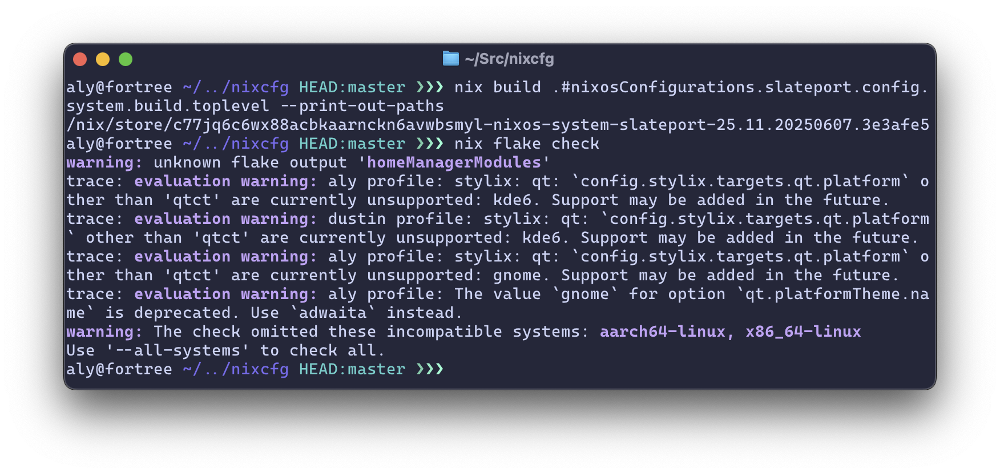

# Stop Breaking Things:

## A Gentle Introduction to NixOS in the Homelab

### Aly Raffauf

[self2025.aly.codes](https://self2025.aly.codes)


---

## `whoami`

- Occasional contributor to NixOS/nixpkgs and related projects.
- Using NixOS for ~3 years.
- Using Linux since 2007.
- Self hosting since 2008.
- Building my own distros since 2009.
- Writing package managers since 2010.

<!--
I'm a little...totalitarian.

Self-hosting from a ThinkPad under the bed.

I've always wanted a lot of control over my linux distros.
-->

---

## How Server Maintenance Feels


<!--
And in that time, I've realized that maintaing a server--one, two, 30, 50, 300--still feels a lot like this.
-->

---

## The Problem

- Stuff breaks.
- Why is this not working?
- We forget how we fixed it last time.
- Sometimes we don’t even know it’s broken.
- Fixes take too long.
- Recovery is slow, manual, and painful.

Mean time to recovery? Who knows!

<!--
Here's how it goes.
-->

---

## What We Need

- Deployments we can rebuild from scratch — confidently.
- Infrastructure that documents itself.
- Version control — for configs, packages, services, environments.
- Reproducible results — today, next month, on new hardware.
- Rollbacks that _just work_.
- Resilient tooling that catches mistakes before they happen.

<!--
We need resilient systems that can be rebuilt from scratch, come already documented, and are version controlled.
-->

---

## What We Have

- Bash
- Ansible
- Docker
- etc.

<!--
There's a lot of attempts at solving this problem, or subsets of it.

Others exist (eg. imaging), but let's focus on these 3.
-->

---

## Bash

- Writing good Bash is hard — and debugging it is harder.
- Scripts mutate the system with **no memory or structure**.
- Works great until someone reruns it on a slightly different machine.
- No built-in rollback, no state tracking, no reproducibility.
- **You are the package manager**.


<!--
How many folks have used some funky collection of Bash scripts to manage their machines?
-->

---

## Ansible

- Looks declarative — but it's not truly **deterministic**.
- Final system state depends on execution order and host state.
- Still no rollbacks, and testing can be painful.
- YAML sucks.


<!--
Anyone using Ansible?

Sometimes brings systems from an unknown state to another unknown state.

Because you're not starting from scratch from the bootloader to the userland, drift is inevitable.
-->

---

## Docker

- Great for shipping **applications**, not entire systems.
- Depends heavily on **mutable base images**.
- "FROM ubuntu:latest" = hope you cached it.
- Dockerfiles are **imperative scripts in disguise**.


<!--
Docker is great for apps, not entire systems.

Even bootable containers have some clear limitations.

Dockerfiles are really just imperative sequences compiled into layers.
-->

---

## Nix

I use NixOS btw.


<!--
And, if you're like me, you use NixOS (by the way).

Or, if you're here, you're at least Nix-curious.
-->

---

## What is Nix?

- A collision-free package manager.
- A side effect free build system.
- A purely functional Turing-complete programming language.
- A script-and-text-file orchestration system.
- A large repository of packages.
- A composable linux distro.


<!--
Nix - the package manager.
Nix - the language.
Nix - the build system.
NixOS - the linux distro.
nixpkgs - the package repository.
-->

---

## Understanding Nix

| Imperative Systems                        | Nix (Declarative)                                                              |
| ----------------------------------------- | ------------------------------------------------------------------------------ |
| “Do this, then that...”                   | “Here’s what the system should look like.”                                     |
| Hidden changes in `/usr`, `/etc`, `$HOME` | Everything in `/nix/store` (immutable, content-addressed), symlinked elsewhere |
| Dependent on machine state                | Same inputs = same results, every time                                         |
| Manual rollback (if you're lucky)         | Atomic generations and easy rollbacks                                          |
| Bash, Ansible, `apt`, `dnf`               | `nix`, `nixos-rebuild`, `home-manager`                                         |
| Scripts, Playbooks                        | \*.nix files, Flakes                                                           |

<!--
Do this, then that vs. produce this.

Systems are built from immutable derivations stored in the Nix store by hash, symlinked into place.

Upgrades and rollbacks are non-destructive.

Managed by nix, nixos-rebuild, darwin-rebuild, home-manager, etc.

Anyone heard of Flakes?
-->

---

## Flakes

- A standardized way to define & share Nix projects.
- Inputs → configuration logic → reproducible outputs.
- All inputs are locked in `flake.lock` to exact hashes.
- Outputs are cached in the Nix store — locally or remotely.
- Flakes make Nix builds **composable**, **shareable**, and **reproducible by default**.


<!--
Meme source: https://fedi.astrid.tech/notice/AS7z9qW0q6SYs9LEsC

Nix typically deployed from Flakes.

Experimental feature, over 80% of Nix users use them.

Declare inputs, declare outputs.

Inputs locked by hash in a flake.lock file.

Nix builds can be intensive, but results are hashed and can be uplaoded to a remote cache.

Subsequent rebuilds are significantly faster.
-->

---

## Flake Inputs

- Other flakes (like `nixpkgs`).
- Remote Git repositories (`github:user/repo`, `git+https://…`).
- Tarballs and zip archives (e.g. plugin releases, configs).
- Local directories (relative or absolute paths).

---

## Flake Outputs

- `packages`: apps, containers, files, tools, scripts.
- `devShells`: reproducible development environments.
- `nixosConfigurations`: full NixOS systems.
- `homeConfigurations`: Home Manager setups.
- `modules`: reusable app, system, or service configurations.

<!---
Modules can be dynamic and configured by-host after import.
-->

---

```nix
aly@fortree ~/../nixcfg HEAD:master ❯❯❯ nix flake show --all-systems
├───devShells
│   └───x86_64-linux
│       └───default: development environment 'nix-shell'
├───nixosConfigurations
│   └───sootopolis: NixOS configuration
├───nixosModules
│   ├───nixos: NixOS module
│   ├───snippets: NixOS module
│   └───users: NixOS module
├───overlays
│   └───default: Nixpkgs overlay
└───packages
    └───x86_64-linux
        ├───deployer: package 'deployer'
        └───formatter: package 'formatter'
```

<!--
Simplified overview of my flake based on its outputs.

Gathered with the `nix flake show` command.
-->

---

## Hello, world!

```nix
{
  description = "Hello, world! with nixpkgs";

  inputs = {
    nixpkgs.url = "github:nixos/nixpkgs?ref=nixos-unstable";
  };

  outputs = { self, nixpkgs }: {
    packages.x86_64-linux.hello = nixpkgs.legacyPackages.x86_64-linux.hello;
  };
}
```

<!--
The most trivial flake.

Outputs an x86-64 build of the GNU Hello package
-->

---

## OCI Containers

```nix
{
  description = "Hello, world! with docker";

  inputs = {
    nixpkgs.url = "github:nixos/nixpkgs?ref=nixos-unstable";
  };

  outputs = { self, nixpkgs }: {
    packages.x86_64-linux.dockerHello = nixpkgs.legacyPackages.x86_64-linux.dockerTools.buildImage {
      name = "hello";
      tag = "latest";
      contents = [ nixpkgs.legacyPackages.x86_64-linux.hello ];
      config.Cmd = [ "/bin/hello" ];
    };
  };
}
```

<!--
You can also build Docker containers with Nix.
-->

---

## NixOS

```nix
    nixosConfigurations.self2025 = nixpkgs.lib.nixosSystem {
      system = "x86_64-linux";
      modules = [{
        boot.loader.grub.device = "/dev/sda";
        fileSystems."/" = {
          device = "/dev/sda1";
          fsType = "ext4";
        };
        services.openssh.enable = true;
        users.users.root.initialPassword = "nixos";
      }];
    };
```

<!--
Extremely simple NixOS config.

Bootloader
Filesystem
Openssh
Temporary root password.
-->

---

## This Slide Deck

```nix
  packages."x86_64-linux".default = pkgs.stdenv.mkDerivation {
        buildPhase = ''marp index.md'';

        installPhase = ''
          mkdir $out
          cp index.html $out/
          cp -r img $out/
        '';

        name = "stop-breaking-things";
        nativeBuildInputs = [pkgs.marp-cli];
        src = self;
        version = "dev";
      };
    });
```

<!--
These slides are also built with a flake.

buildPhase
installPhase
build and runtime dependencies
source tree
-->

---

## Nix CLI

| Option             | What it does                               |
| ------------------ | ------------------------------------------ |
| `nix build`        | Build flake outputs                        |
| `nix develop`      | Launch a dev shell with specified packages |
| `nix flake check`  | Check flakes for errors                    |
| `nix flake update` | Update flake inputs                        |
| `nix run`          | Run an app from a flake                    |



<!--
Nix command line

build
run
test (for evaluation and custom tests)
updating flake inputs
-->

---


<!--
Building one of my servers remotely.
On conference WiFi.
BTW, fortree is aarch64-darwin and slateport is x86_64-linux.

Then, checking the whole flake for eval errors.

Note the trace.
-->

---

## `nixos-rebuild`

- Instantly switch to a new system config, or stage it for next boot.
- Test changes safely without touching the bootloader.
- Build VM or cloud images from your exact config.
- Deploy to or build on remote machines.


<!--
How you switch between generations of your system config.

Unlike other atomic/immutable distributions, you don't need to reboot.

nixos-rebuild brings your running system to the desired state.

(kernel updates require reboots)
-->

---


<!--
Evaluates your flake.
Build the system configuration.
Decrypts my secrets with agenix.
Sets up /etc
Restarts/stops/starts services as-needed.
Prints a store path to the system configuration.
-->

---

## What Nix Lets Us Do

- Evaluate before we build.
- Build before we commit.
- Test before we merge.
- Commit before we deploy.

In other words, **GitOps**.


<!--
Lets us realize GitOps workflows for our whole system.
-->

---

## My Homelab


---

## The Machines

- 7 NixOS servers across three 'data centers'.
  - 5 local, 1 Hetzner, 1 AWS (usually).
- 4 client laptops.
  - 3 running NixOS, 1 running nix-darwin.
- 3 architectures (x86_64-linux, aarch64-linux, aarch64-darwin).
- 5 users.
- Named for places in Pokémon Ruby & Sapphire.
- Networked with Tailscale.

<!--
Ranges from a beefy Ryzen system to a 10 year old ThinkCentre to a Rapsberry Pi and a t2.micro on AWS.

The same flake defines both my homelab, my cloud servers, and mine and my husband's personal devices, e.g. this laptop.
-->

---


<!--
So what do I host on these machines?

Plex, Ombi, Immich, Vaultwarden, Karakeep, Forgejo (git forge), action runners for my CI, my website, and my Bluesky Personal Data Server.
-->

---

## How I Use Nix to Not Break Things

---

## Declared and Reusable Infrastructure

- ~10,000 lines of Nix modules.
- For the past two years, almost every config I've written is in a Nix module.
- Apps, settings, services, boot loaders, kernel modules, fonts, WiFi networks in Nix.
- Enabled on a host-by-host basis with a line or two of code.


<!--
This sounds like a lot, but it's the result of 3 years of effort.

Any time I need to configure something, I try to do it in the Nix way.

Firefox? Nix. Git? Nix. VS Code? Nix.

A complicated Pipewire filter-chain to make this laptop's speakers sound better than horrible? Nix.
-->

---


<!--
Modules can be dynamic, with their own options and tunings. They don't have to be static blocks of code.
-->

---

## Continuous Integration

- Every push triggers checks for eval and formatting errors.
- Flake outputs are built automatically.
- Build artifacts are cached.
- Scheduled actions update `flake.lock`.
- Nothing is merged until CI passes.


<!--
On every push, CI checks for evaluation and formatting errors, then builds every flake output. So we don't waste anything, the results (custom settings, packages, etc.) are cached.
-->

---

## Automatic Deployments

- Nightly updates from master.
- Dependencies pulled from cache.
- Builds distributed across the fleet.
- Small systems built remotely.
- Manual deployments do not touch the bootloader.


<!--
There are many Nix deployment tools, many of which itnegrate with GitHub Actions and other CI tools.

I've written my own in Go, but I mainly rely on NixOS's built-in auto upgrade module.
-->

---


<!--
Here my module is a wrapper around a module included in nixpkgs, with my complete settings.

Set operation, reboots, etc.
-->

---

## Q&A

Thank you!

P.S. I am extremely hirable for cloud engineer and devop type roles. :)

[www.aly.codes](https://aly.codes)


