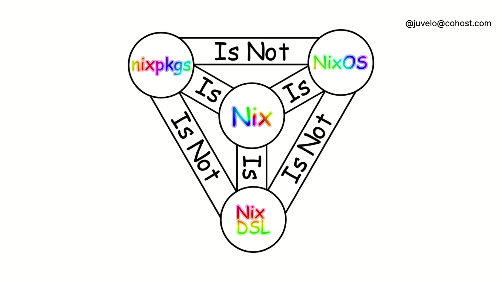

# Stop Breaking Things:

## A Gentle Introduction to NixOS in the Homelab

### Aly Raffauf

---

## How Server Maintenance Feels


---

## The Problem

- Stuff breaks.
- We forget how we fixed it last time.
- Sometimes we don’t even know it’s broken.
- Fixes take too long.
- Recovery is slow, manual, and painful.

Mean time to recovery? What's that?

---

## What We Need

- A system we can rebuild from scratch — confidently.
- Infrastructure that documents itself.
- A way to version everything — configs, packages, environments.
- Reproducible results — today, next month, on new hardware.
- Rollbacks that *just work*.
- Tooling that catches mistakes before they happen.

---

## What We've Tried

- Bash
- Ansible
- Docker

---

## Bash

- Writing good Bash is hard — and debugging it is harder.
- Scripts mutate the system with no memory or structure.
- Works great until someone reruns it on a slightly different machine.
- No built-in rollback, no state tracking, no reproducibility.
- You are the package manager.

---

## Ansible

- Looks declarative — but it's not truly deterministic.
- Final system state depends on execution order and host state.
- YAML sucks.
- Still no rollbacks, and testing can be painful.

---

## Docker

- Great for shipping **applications**, not entire systems.
- Depends heavily on **mutable base images**.
- "FROM ubuntu:latest" = hope you cached it.
- Dockerfiles are **imperative scripts in disguise**.

---


---

## What is Nix?

- A collision-free atomic package manager.
- A functional build system.
- A purely functional Turing-complete programming language.
- A script-and-text-file orchestration system (with symlinks).
- A composable linux distribution.

---

## Nix vs Nix vs Nixpkgs vs NixOS

- Nix: a programming language.
- Nix (the implemented package manager, interpreter, build system, daemon)
- nixpkgs - a large monorepository of thousands of
- NixOS - the linux-based

---



---

## Understanding Nix

| Imperative Systems                        | Nix (Declarative)                                                  |
| ----------------------------------------- | ------------------------------------------------------------------ |
| “Do this, then that...”                   | “Here’s what the system should look like.”                         |
| Hidden changes in `/usr`, `/etc`, `$HOME` | Everything in `/nix/store` (immutable, content-addressed)          |
| Dependent on machine state                | Same inputs = same results, every time                             |
| Manual rollback (if you're lucky)         | Atomic generations and easy rollbacks (`nixos-rebuild --rollback`) |
| Bash, Ansible, `apt`, `dnf`               | `nix`, `nixos-rebuild`, `home-manager`                             |
| Scripts, Playbooks                        | \*.nix files, Flakes                                               |

---

## Flakes

- A standardized way to define and share Nix projects.
- Inputs (like `nixpkgs`) → configuration logic → reproducible outputs.
- All inputs are pinned in `flake.lock` to exact hashes — no surprises on rebuild.
- Outputs are cached in the Nix store — locally or remotely
- Flakes make Nix builds **composable**, **shareable**, and **reproducible by default**.

---

## Flake Inputs

- Other flakes (like `nixpkgs`)
- Remote Git repositories (`github:user/repo`, `git+https://…`)
- Tarballs and zip archives (e.g. plugin releases, configs).
- Local directories (relative or absolute paths)

---

## Flake Outputs

- `packages`: apps, containers, files, tools, scripts.
- `devShells`: reproducible development environments.
- `nixosConfigurations`: full NixOS systems.
- `homeConfigurations`: Home Manager setups.
- `modules`: reusable app, system, or service configurations.
- `apps`: things you can run with `nix run`.

---

## Hello, world!

```nix
{
  description = "Hello, world! with nixpkgs";

  inputs = {
    nixpkgs.url = "github:nixos/nixpkgs?ref=nixos-unstable";
  };

  outputs = { self, nixpkgs }: {
    packages.x86_64-linux.hello = nixpkgs.legacyPackages.x86_64-linux.hello;
  };
}
```

---

## OCI Containers

```nix
{
  description = "Hello, world! with docker";

  inputs = {
    nixpkgs.url = "github:nixos/nixpkgs?ref=nixos-unstable";
  };

  outputs = { self, nixpkgs }: {
    packages.x86_64-linux.dockerHello = nixpkgs.legacyPackages.x86_64-linux.dockerTools.buildImage {
      name = "hello";
      tag = "latest";
      contents = [ nixpkgs.legacyPackages.x86_64-linux.hello ];
      config.Cmd = [ "/bin/hello" ];
    };
  };
}
```

---

## DevShells

```nix
{
  description = "Hello, world! devshell (auto-runs hello)";

  inputs.nixpkgs.url = "github:nixos/nixpkgs?ref=nixos-unstable";

  outputs = { self, nixpkgs }: {
    devShells.x86_64-linux.default = nixpkgs.legacyPackages.x86_64-linux.mkShell {
      packages = [ nixpkgs.legacyPackages.x86_64-linux.hello ];
      shellHook = ''
        hello
      '';
    };
  };
}
```

---

## NixOS

```nix
{
  description = "Minimal NixOS flake";
  inputs.nixpkgs.url = "github:NixOS/nixpkgs/nixos-unstable";

  outputs = { self, nixpkgs }: {
    nixosConfigurations.self2025 = nixpkgs.lib.nixosSystem {
      system = "x86_64-linux";
      modules = [{
        boot.loader.grub.device = "/dev/sda";
        fileSystems."/" = {
          device = "/dev/sda1";
          fsType = "ext4";
        };
        services.openssh.enable = true;
        users.users.root.initialPassword = "nixos";
      }];
    };
  };
}
```

---

## Why?

- Configure everything in a common language

  lkj
